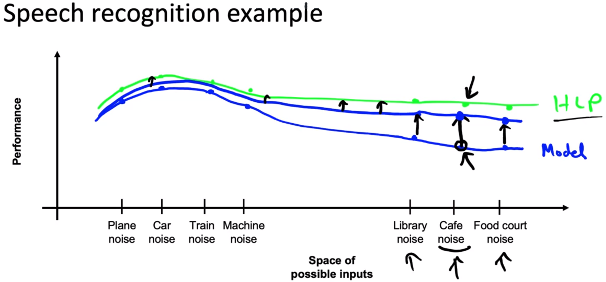
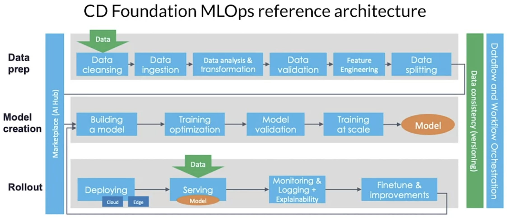
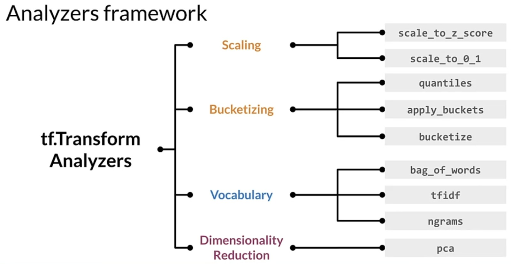

# 1. Course One: Introduction to Machine Learning in Production
## 1.1. Week 1: Overview of the ML Lifecycle and Deployment
### 1.1.1. Steps of an ML Project
* Two crucial points: Data drift & concept drift
    * E.g. children start to use Siri more, which is trained mostly on adults.
    * The factory gets darker but most of the training photos of products were under well-lit conditions.
* Steps:
    * **Scoping**
        * Define project
            * Decide what to work on. E.g. speech recognition for voice search.
            * Define key metrics (accuracy, latency, throughput, privacy etc.)
            * Define resources & timeline
    * **Data**
        * Define data and establish baseline.
        * Label and organize data.
            * Is the data labeled consistently?
    * **Modeling**
        * Select & train model
            * Code (algorithm/model)
            * Hyperparameters
            * Data
        * Perform error analysis
            * Pinpoint the parts to be improved.
        * Side note: Research/Academia mostly focuses on `code` & `hyperparameters` whereas product teams focus on `hyperparameters` and `data` and take action accordingly.
    * **Deployment**
        * Deploy in production
            * Edge/Mobile device or PC browser? 
        * Monitor & maintain the system
            * Concept/Data drift!
### 1.1.2. Key Challenges
* **Data drift (`X`)**
    * Distribution X changes, but mapping from X --> Y doesn't change.
    * E.g. new celebrity becomes much more well-known and starts to appear on voice search more.
* **Concept Drift (`X --> Y`)**
    * Definition of Y changes as X changes.
    * E.g. At Covid-19, a lot of online purchasing flagged as fraud (`false positive`) since people normally didn't shop online that much.
* Sometimes changes happen gradually as in language (new words or phrases get popular), and sometimes it happens suddenly as in online shopping during Covid-19.
* **Software Engineering Issues**
    * Checklist of questions:
        * Realtime or batch?
            * For example, some of my projects work on ***batches*** since the jobs scheduled to start on specific hours to work on the most current data saved to the database.
        * Cloud vs. Edge/Browser
            * Factories mostly work on edge devices due to possible internet shortages.
        * Compute resources (CPU/GPU/Memory)
            * Sometimes you train your model on powerful GPUs but will it be used on such devices as well? Maybe you will deploy it on a small edge device. ***Is it as powerful as the GPUs in your cloud/local device?***
        * Latency, throughput (QPS)
            * Maybe your limits are `500ms` or `1000 queries per second`?
        * Logging
        * Security & Privacy
### 1.1.3. Deployment Patterns
* Common cases:
    * New product/feature
    * Automate/assist with manual task
    * Replace previous ML system
* Key ideas:
    * Gradual ramp up with monitoring (Start with small traffic).
    * Rollback if not working.
* First Stage (`Shadow Mode`)
    * ML system shadows the human & runs in parallel. Human ***observes*** it firstly.
    * The system output shouldn't be used for any decisions during this phase.
* Second Stage (`Canary Deployment`)
    * *"Canary in a coal mine"*
    * Roll out for small fraction (say `5%`) of traffic initially.
    * Monitor the system and ramp up the traffic gradually.
* Third Stage (`Blue Green Deployment`)
    * First,
        * [`Phone Images`] ---> [`Router`] ---> Old/Blue Version
    * Later, **switch** to `Green` version.
        * [`Phone Images`] ---> [`Router`] ~~---> Old/Blue Version~~ ---> New/Green Version
    * Easy way to enable rollback
* Degrees of Automation
    1. Human Only
    2. Shadow Mode
    3. AI Assistance [`Human in the loop`]
        * e.g. only provides `bounding box` to human
    4. Partial Automation [`Human in the loop`]
        * if AI is not confident, sends it to human. This is also useful for developing better models.
    5. Full Automation
        * You don't have to go to full automation all the time. You can stop before getting it if you like.
### 1.1.4. Monitoring
* You can monitor anything you want: Server load, fraction of non-null values, fraction of missing input values etc.
* Brainstorm the things that could go wrong.
* Brainstorm a few statistics/metrics that will detect the problem.
* It is ok to use many metrics initially and gradually remove the ones you find not useful.
* Example metrics to track (e.g. for a speech recognition system)
    * Software Metrics: Memory, compute, latency, throughput, server load
    * **Input Metrics (X)**: Average input length, average input volume, # of missing values, average image brightness or size or shape
    * **Output Metrics (Y)**: # of times `" "` (null), # of times user redoes the search, # of times user switches to typing, CTR (click-through rate)
* Just as ML modeling is iterative, so is deployment!
    * Deploy/Monitor ---> Traffic ---> Perform Analysis ---> Deploy/Monitor ---> ...
    * Choosing a right metric is an iterative process as well. Sometimes you discover a new problem after a few weeks and start to track it on a new metric, or sometimes a metric doesn't change at all and gives no insight/information and turns out to be useless.
* Common Practices
    * Set threshold for alarms
        * E.g. server load gets `> 90%`
        * Missing values get below *some point*.
* You will adapt metrics and thresholds over time.
* Then you will perform ***manual training*** (more common) or ***automatic training*** (used more in consumer software internet) if necessary.
### 1.1.5. Pipeline Monitoring
* A sample "speech recognition" pipeline:
    1. [`Audio`] --->
    2. [`Voice Activity Detection (VAD)`] (A model that detects if user is speaking to the assistant or not.) --->
    3. [`Speech Recognition`] (A model that transcripts the audio it receives from `VAD`.) --->
    4. [`Transcript`]
* Here, `VAD` (which is on the device) gets the speech and clips it to reduce bandwidth sent to cloud and passes it to the `speech recognition` (which is on the cloud). However, if the performance of `VAD` decreases, it affects the performance of `Speech Recognition` system as well!
* Another "user profile" pipeline:
    1. [`User Data`] (e.g. clickstream) --->
    2. [`User Profiler Model`] (e.g. own a car?) --->
    3. [`Recommender System`] --->
    4. [`Product Recommendations`]
* Here, let's say for the question "User owns a car?", `user profiler model` provides `Y`, `N` or `UNKNOWN` to the `Recommender System`. If the `UNKNOWN` labels (which you monitor) start to increase, recommender system's performance gets worse over time, so do the recommended products'.
* How quickly do the data change?
    * User data generally has slower drift.
        * Exceptions: Covid-19, a holiday destination becomes popular all of a sudden etc.
    * Enterprise data (B2B applications) can shift fast.
        * A company start to use another raw material for their end product.
### 1.1.6. Quiz
* **Q:** You have built and deployed an anti-spam system that inputs an email and outputs either 0 or 1 based on whether the email is spam. Which of these will result in either concept drift or data drift?
    * **A:** Spammers trying to change the wording used in emails to get around your spam filter.
### 1.1.7. Week 1 References
* [Concept and Data Drift](https://towardsdatascience.com/machine-learning-in-production-why-you-should-care-about-data-and-concept-drift-d96d0bc907fb) (not read yet)
* [Monitoring ML Models](https://christophergs.com/machine%20learning/2020/03/14/how-to-monitor-machine-learning-models/) (not read yet)
* [A Chat with Andrew on MLOps: From Model-centric to Data-centric](https://www.youtube.com/watch?v=06-AZXmwHjo) (not watched yet)
* [Konstantinos, Katsiapis, Karmarkar, A., Altay, A., Zaks, A., Polyzotis, N., … Li, Z. (2020). Towards ML Engineering: A brief history of TensorFlow Extended (TFX)](http://arxiv.org/abs/2010.02013) (not read yet)
* [Paleyes, A., Urma, R.-G., & Lawrence, N. D. (2020). Challenges in deploying machine learning: A survey of case studies.](http://arxiv.org/abs/2011.09926) (not read yet)
* [Sculley, D., Holt, G., Golovin, D., Davydov, E., & Phillips, T. (n.d.). Hidden technical debt in machine learning systems. Retrieved April 28, 2021, from Nips.c](https://papers.nips.cc/paper/2015/file/86df7dcfd896fcaf2674f757a2463eba-Paper.pdf) (not read yet)
## 1.2. Week 2: Select and Train a Model
### 1.2.1. Modeling Overview
* As hinted in the _side note_ in 1.1.1, it could be more useful to collect high quality data (`data-centric AI development`) instead of solely focusing on neural network architectures (`model-centric AI development`). Of course it's not about collecting more and more data either. It is about improving the data in the most efficient possible way.
### 1.2.2. Key Challenges
* _"Because machine learning is such an empirical process, being able to go through the training/error analysis/model+hyperparameters+Data loop many times very quickly is key to improving performance."_
* After doing enough iterations, one last thing to do could be performing a richer error analysis to audit performance.
* For many years, the engineering team focused on the performance on dev/test sets, which failed on business metrics & project goals. After doing fine on both training and dev/test sets, it's crucial to focus on these project goals as well.
### 1.2.3. Why Low Average Error Isn't Good Enough
* Performance on disproportionately important examples!
    * User may forgive the slightly irrelevant results of the web search query `apple pie recipes`, but when the query is `reddit`, user has a crystal clear intent on this navigational query. Thus, if dev/test set performance is good in overall but the model messes up on this little group of navigational queries, it could be a serious problem. You could put more emphesis on this little but important group but it still doesn't solve the entire problem.
* Performance on key slices of the dataset
    * Make sure not to discriminate by ethnicity, gender, location, language or other protected attributes. (Loan approval model)
    * Be careful to treat fairly all major user, retailer, and product categories. (Product recommendation model)
* Rare classes
    * Skewed data distribution: 99% negative data points, 1% positive data points. If you just `print("negative")`, you could be 99% correct, which could be the dumbest thing ever. You need to focus on, for example, rare diseases in a medical dataset. A rare case could be extremely important and fatal to be ignored, even though these cases don't hurt the averate test set performance.
* **You need to go beyond the test set and think like a product owner!**
### 1.2.4. Establish a Baseline
* When you see the accuracies below, you could think that "We need to work on _low bandwidth_ accuracy!". However, if it is practically on HLP (Human Level Performance) level, you should think about improving _car noise_ speeches instead.

    |Type|Accuracy|HLP|Improvement|
    |:---|:---:|:---:|:---:|
    |Clear Speech|94%|95%|1%|
    |Car Noise|89%|93%|4%|
    |People Noise|87%|89%|2%|
    |Low Bandwidth|70%|70%|~0%|

* HLP is a less useful baseline for a structured data (such as spreadsheet/tabular data) than images, audios and text (user comments etc.).
* Ways to establish a baseline:
    * HLP
    * Literature search for SoTA/open source materials
    * Quick-and-dirty implementation
    * Performance of older system
* Baseline helps to indicate what might be possible. In some cases (such as HLP), it also gives a sense of what is irreducible error/Bayes error (an upper limit to your system's potential). So, we can be much more efficient in terms of prioritizing what to work on.
* Make this establishment in the beginning to save time!
### 1.2.5. Tips for Getting Started
* Literature search to see what's possible (courses, blogs, open-source projects)
* Find open-source implementations if available.
* Don't obsess with the SoTA algorithms. A reasonable algo with good data will often outperform a great algo w/ no so good data.
* Just get started and iterate more!
* Should you take into account deployment constraints when picking a model?
    * Yes, if a baseline is already established and goal is to build & deploy.
    * No, if the purpose is to establish a baseline and determine what is possible and might be worth pursuing.
* Sanity-check for code & algorithm
    * Try to overfit a small training dataset before training on a large one.
### 1.2.6. Error Analysis Example
* Collaborative tagging, training and deploying platform: [landing.ai (formerly LandingLens)](https://landing.ai/platform/)
* You can come up with common problems (in a speech recognition model) like "car noise", "people noise" etc. and listen random audio clips that were predicted wrong, and then thick under these problems in a regular spreadsheet. Think about your banner project, you can detect problematic products by creating such a spreadsheet and thick the possible problems.
* Iterative process: Examine tag examples <------> Propose tags
* Useful metric questions for each tag (error class):
    * "What fraction of errors has that tag?" e.g. 12% in all the classes
    * "Of all data with that tag, what fraction is misclasiffied?" e.g. all the data with "car noise", 18% is misclassified. It tells you how hard the examples with car noise are.
    * "What fraction of all the data has that tag?"
    * "How much room for improvement there is on data with that that?" e.g. measuring HLP.
 ### 1.2.7. Prioritizing What to Work on
|Type|Accuracy|HLP|Improvement|% of data|Raise in Avg. Acc.|
|:---|:---:|:---:|:---:|:---:|:---:|
|Clear Speech|94%|95%|1%|60%|0.60%|
|Car Noise|89%|93%|4%|4%|0.16%|
|People Noise|87%|89%|2%|30%|0.60%|
|Low Bandwidth|70%|70%|~0%|6%|~0%|
* Previously, we said that _"we should think about improving _car noise_ speeches instead"_ considering the gap to the HLP, but when we make a deeper analysis, we see that working on _people noise_ and _clear speech_ might increase the average accuracy by 0.6% individually. Thus, considering the **amount of data** is another crucial factor here!
* To prioritizing stuff, ask yourself:
    * How much room for improvement there is.
    * How frequently that category appears.
    * How easy to improve accuracy in that category is.
    * How important it is to improve that category.
* Thus, you don't have to collect more data for _not-that-vital_ categories and save time!
### 1.2.8. Skewed Datasets
* When you have very skewed data, raw accuracy score is not much useful (remember `print("negative")` from the ***Section 1.2.3***).
* **Confusion Matrix** (with _recall_, _precision_ & _F1-score_) is much more useful!
    * **Precision:** [focuses on `FP`] A _not defected_ smartphone goes to human inspection since the model predicts it as _defected_. Not that crucial for the company in this case.
    * **Recall:** [focuses on `FN`] A _defected_ smartphone goes into the market and gets sold as defected! It is ***crucial*** for the company!
### 1.2.9. Performance Auditing
* Brainstorm the ways the system might go wrong (_speech recognition_ examples below):
    * Performance (e.g. accuracy) on subsets of data
        * Accuracy on ethnicity, gender
        * Accuracy on different devices
        * Prevalence of rude mis-transcriptions (e.g. GAN --> gun, gang)
    * How common are certain errors (e.g. FP, FN)
    * Performance on rare classes
* Establish metrics to assess performance against these issues on appropriate slices of data.
    * Mean accuracy for different genders & major accents.
    * Mean accuracy for different devices.
    * Check for prevalence of offensive words in the output.
* Get business/product ownder buy-in.
### 1.2.10. Data-centric AI development
* The quality of the data is paramount. Use tools to improve data quality; this will allow multiple models to do well.
* Hold the code fixed & iteratively improve the data.
* In academy, they hold the data fixed and work on the models because a fixed dataset lets you perform benchmark tests on different models.
### 1.2.11. A useful picture of data augmentation

* When we push the performance of a point up, the nearby points get affected more than the farther points.
### 1.2.12. Data Augmentation
* What type of noise to be used? How loud shoud it be?
* Goal is to **create realistic examples** that:
    * ***the algorithm does poorly on***,
    * but humans (or other baseline) do well on
* Checklist:
    * Does it sound realistic?
    * Is the X ---> Y mapping clear? (e.g. can humans recognize speech?)
    * Is the algorithm currently doing poorly on it?
### 1.2.13. Can adding data hurt?
* For ***unstructured*** data problems, if:
    * the model is large enough (low bias),
        * e.g. increase café data from 20% to 50%. Yes, it changes the data distribuion $P(x)$ but if the model is large enough, it increases the performance unless the model is small. Then it hurts the non-café data performance.
    * the mapping X ---> Y is clear (e.g. given only the input X, humans can make accurate predictions.),
        * e.g. in Google street view images, there are hard cases on house numbers. It is quite hard to guess between the number $1$ and the letter $I$ in the images. Thus, creating synthetic images with $I$ could hurt the performance in this case since it is a corner case where a lot of house numbers don't contain letters. In this case, it is safer to guess $Is$ as $1$.
        * Adding a lot of new $Is$ may skew the dataset. 
    * then, **adding data rarely hurts accuracy**.
### 1.2.14. Adding Features
* Restaurant recommendation example (**Structured** data problems):
* Our system recommends meat options to a vegetarian! We want to change that. Imagine the model takes `person` and `restaurant` examples and `recommends` a new restaurant to user. Also, you know that you can't changed the structured data here much, which are `person` and `restaurant`. They are kinda fix and data synthesising is not possible (are you going to create a fake restaurant ffs?). So, one thing to do that you can add a new feature to these data.
* What possible features to add?
    * Is person vegetarian (based on past orders)?
        * Doesn't need to be a discrete data. It could be the percentage of fruits ordered.
    * Does restaurant have vegetarian options (base on their menu)?
        * To detect it, you can use another model that reads the menu. Or some basic algorithm to detect it.
* There is a shift on filtering in recommendation systems from `Collaborative filtering` to `Content based filtering`.
    * **Collaborative filtering**: Recommends items which other profiles similar to you consume.
        * This has `cold-start` problem. How do you recommend a brand-new restaurant which doesn't have any stars, reviews or comments? If no one interacted with this item, it won't be recommended to anybody.
    * **Content based filtering**: Model analyses you and the item, then matches it according to similar interests.
        * It solves the `cold-start` problem.
        * but it requires a successful feature extraction process from that brand-new item.
* ***Adding features*** is also an iterative process. The features are data as well! So, you add your features, train the model, do error analysis and observe the performance of the features you added, then iterate.
    * Error analysis can be harder if there is no good baseline (such as HLP) to compare to.
    * Error analysis, user feedback & benchmarking to competitors can all provide inspiration for features to add.
* In pre-deep learning era, the feature extraction and creation was more important. Now, the DL algorithms discover the features in images, sounds and texts pretty good. However, in ***structured*** data, it is still a thing.
### 1.2.15. Experiment Tracking
* What to track:
    * Algorithm/code versioning
    * Dataset used
    * Hyperparameters
    * Results
* Tracking tools:
    * Text files (This doesn't scale well. C'mon!)
    * (Shared) Spreadsheet
    * Experiment tracking system
        * ``WandB``
        * ``Comet MLflow``
        * ``SageMaker Studio``
        * ``Landing.AI`` (on computer vision & manufacture systems)
* Desirable features:
    * Information needed to replicate results.
    * Experiment results, ideally with summary metrics/analysis
    * Perhaps also: Resource monitoring, visualization, model error analysis
### 1.2.16. From Big Big Data to Good Data
* Try to ensure consistently high-quality data in all phases of the ML project lifecycle.
* Good data:
    * Covers important cases (good coverage of inputs X),
    * Is defined consistently (definition of labels Y is unambiguous),
    * Has timely feedback from production data (distribution covers data drift & concept drift),
    * Is sized appropriately.
### 1.2.17. Week 2 Optional References
* [Establishing a baseline](https://blog.ml.cmu.edu/2020/08/31/3-baselines/) (not read yet)
* [Error analysis](https://techcommunity.microsoft.com/t5/azure-ai/responsible-machine-learning-with-error-analysis/ba-p/2141774) (not read yet)
* [Experiment tracking](https://neptune.ai/blog/ml-experiment-tracking) (not read yet)
* [Brundage, M., Avin, S., Wang, J., Belfield, H., Krueger, G., Hadfield, G., … Anderljung, M. (n.d.). Toward trustworthy AI development: Mechanisms for supporting verifiable claims.](http://arxiv.org/abs/2004.07213v2) (not read yet)
* [Nakkiran, P., Kaplun, G., Bansal, Y., Yang, T., Barak, B., & Sutskever, I. (2019). Deep double descent: Where bigger models and more data hurt](http://arxiv.org/abs/1912.02292) (not read yet)
## 1.3. Week 3: Data Definition and Baseline
### 1.3.1. Why is data definition hard?
* Because inconsistency in data labeling confuses the model while training.
    * Remember the iguana picture.
        * How will you draw bounding boxes for them?
        * Are all the labelers going to treat the picture in the same way?
        * How can we ensure labelers give consistent labels?
### 1.3.2. Major types of data problems
* For small data (~10,000),
    * Clean labels are critical.
    * Can manually look through dataset and fix labels.
    * Can get all the labelers to talk to each other.
* For big data,
    * Emphasis on data process.
    * Clean labels are still important but it could be hard to go through a million data points.
* For unstructured data,
    * May or may not have huge collection of unlabeled examples $x.$
    * Humans can label more data.
    * Data augmentation more likely to be helpful.
* For structured data,
    * May be difficult to obtain more data.
    * Human labeling may not be possible (with some exceptions - remember the "Are they the same user?" question when a company acquires another and tries to merge users.)
* Big data problems can have small data challenges too. For examples, web search engines may have billions of queries in their databases but most of these queries are in fact rare cases.
### 1.3.3. Improving Label Consistency
* Have multiple labelers label same example.
* When in disagreement, have machine learning engineer of this project or subject matter expert (manager in responsible for that part of the factory) and/or labelers discuss definition of y to reach agreement.
* If $x$ is too hard to work on due to various conditions, consider changing $x$.
* Iterate until it is hard to significantly increase agreement.
* Examples:
    * Standardize labels (e.g. `"umm, nearest gas station"`)
    * Merge classes (e.g. _deep scratch_ + _shallow scratch_ ==> _scratch_)
    * Have a class/label [in the middle] to capture uncertainty, e.g:
        * Defect: `0`, `border_line`, `1`
        * `"umm, nearest [unintelligible]"`
* Small Data (unstructured data):
    * Can ask labelers to discuss specific labels since there are small number of labelers.
* Big Data (same):
    1. Get to consistent definition with a small group.
    2. Then send labeling instructions to labelers.
    3. [Last resort!] Can consider having multiple labelers label every example and using voting or consensus labels to increase accuracy.
### 1.3.4. Human Level Performance (HLP)
* In academia, establish and beat a respectable benchmark to support publication.
* Business or product owner asks for 99.9% accuracy. HLP helps establish a more reasonable target.
* "Prove" the ML system is superior to humans doing the job and thus the business or product owner should adopt it.
    * ***Use this argument with caution or don't use it at all.***
* When the ground truth label is externally defined, HLP gives an estimate for Bayes error / irreducible error. But often, ground truth is ***just another human level.***
* When the label $y$ comes from a human level, HLP << 100% may indicate ambiguous labeling instructions.
* Improving label consistency will raise HLP. This makes it harder for ML to beat HLP but the more consistent labels will raise ML performance as well.
* Structured data problems are less likely to involve human labelers, thus HLP is less frequently used. Some exceptions are:
    * User ID merging: Same person or not?
    * Based on network traffic, is the computer hacked?
    * Is the transaction fraudulent?
    * Spam/Bot account?
    * From GPS data, what is the mode of transportation - on foot, bike, bus etc.?
* **Takeaway**: Remember, if HLP << 100%, it may indicate ambiguous labeling instructions. Increasing HLP will increase your model's performance.
### 1.3.5. Obtaining Data
* Let's say you spend `2 days` for **error analysis** and `2 days` for **training**. Then it is advised [by Andrew] not to spend more than ``30 days``. Surely, it could be less but the important thing here is ***to enter the iteration loop much more quickly.***
* Instead of asking: _"How long it would take to obtain $m$ examples?"_
* Ask: _"How much data can we obtain in $k$ days?"_
    * Exception: If you have worked on the problem before and from experience, you know you need $m$ examples.
* Brainstorm the list of data sources (speech recognition example) according to your time and/or money constraints:

    |Source|Amount|Cost|Time|
    |:-|:-:|:-:|:-:|
    |Owned|100h|$0|0|
    |Crowdsourced (Reading)|1000h|$10,000|14 days|
    |Pay for labels (More natural)|100h|$6000|7 days|
    |Purchase data|1000h|$10,000|1 day|

    > **Other factors:** Data quality, privacy, regulatory constraints
* Labeling data
    * Options: In-house vs. outsourced vs. crowdsourced
    * Having MLEs label data is expensive. But doing this for just a few days is usually fine.
* Who is qualified to label?
    * Speech recognition ---> any reasonably fluent speaker
    * Factory inspection, medical image diagnosis ---> SME (subject matter expert)
    * Recommender systems ---> maybe impossible to label well
* Don't increase data by more than `10x` at a time. Increasing like 1000 examples to 3000, $50\%$ more could be better or at most 10,000 but beyond that point, it is impossible to predict what would happen. You might damage the performance.
### 1.3.6. Data Pipeline
* POC (proof-of-concept)
    * Goal is to decide if the application is workable and worth deploying.
    * Focus on getting the prototype to work!
    * It's okay if data pre-processing is manual. But take extensive notes/comments not to forget the steps & procedures.
* Production phase
    * After project utility is established, use more sophisticated tools to make sure the data pipeline is replicable.
    * e.g. Tensorflow Transform, Apache Beam, Airflow etc.
### 1.3.7. Meta-data, data provenance and lineage
* **Data provenance** refers to where the data comes from, and **data lineage** the sequence of processing steps applied to it.
* Logging the data provenance & lineage is still in immature stages and we don't have mature tools for that. However, extensive documentation could help you replicate the system and pursue errors along the way.
* **Meta-data:** Data above data, such as time, factory, line #, camera settings, phone model, inspector ID etc.
    * They could be quite useful when inspected with data (phone pictures in the assembly line).
    * For example, the images from line 17 in factory 2 could be problematic due to some condition.
* Meta-data is useful for:
    * error analysis,
    * spotting unexpected effects,
    * keeping track of data provenance.
### 1.3.8. Balanced train/dev/test splits
* Let's say, you have a small dataset and you specified your train/dev/test percentages as $60/20/20$.
    * You have $100$ examples with $30$ positive and $70$ negative labels.
    * You split it randomly and got $21/2/7$ positive examples, which is an imbalanced split!
        * because you now have $35/10/35\%$ split.
    * Desired split: $18/6/6$ positive examples
        * which gives you a split of train/dev/test with $30/30/30\%$.
* So, if you have a small and imbalanced dataset, you make sure that the split is done randomly but manually arranged.
### 1.3.9. Quiz
* **Q:** You have a data pipeline for product recommendations that (i) cleans data by removing duplicate entries and spam, (ii) makes predictions. An engineering team improves the system used for step (i). If the trained model for step (ii) remains the same, what can we confidently conclude about the performance of the overall system?
    * **False Answer:** It will get worse because stage (ii) is now experiencing data/concept drift.
        * _Close! This could happen - it really depends on what changes were made and how they affect the model. However, it's also possible that the performance of the model improves._
    * **False Answer:** It will definitely improve since the data is now more clean.
        * _Not exactly! The performance of the system could improve. However, although the data is cleaner, your model was trained on the original messier data and it's performance could drop as a result of this data/concept drift._
    * **Correct Answer:** It's not possible to say - it may perform better or worse.
        * _That's right! It's really hard to tell, as it depends on how the data was changed, and how your model behaves._
* **Q:** You are building a visual inspection system. HLP is measured according to _how well one inspector agrees with another._ Error analysis finds:

    |Type of Defect|Accuracy|HLP|% of data|
    |:-|:-:|:-:|:-:|
    |Scratch|95%|98%|50%|
    |Discoloration|90%|90%|50%|

    You decide that it might be worth _checking for label consistency_ on both scratch and discoloration defects. If you had to pick one to start with, which would you pick?
    
    * **A:** It is more promising to check (and potentially improve) label consistency on discoloration defects than scratch defects. Since HLP is lower on discoloration, it's possible that there might be ambiguous labelling instructions that is affecting HLP. _A high HLP metric implies good label consistency, therefore there isn't much room for improvement of HLP for scratch defects. If you find that the labels are indeed consistent for both scratch and discoloration, then you can proceed to closing the model accuracy gap to HLP._
### 1.3.10. What is scoping?
* Scoping example: E-commerce retailer looking to increase sales. Possible projects:
    * Better recommender system
    * Better search
    * Improve catalogue data
    * Inventory management
    * Price optimization
* So, which one to pick? Here are some of the key questions:
    * What project should we work on?
    * What are the metrics for success?
    * What are the resources (data, time, people) needed?
### 1.3.11. Scoping Process
* _"I don't want to hear about your AI problems. I want to hear about your business problems and then it's my job to work with you to see if there is an AI solution."_
* Brainstorm business problems first: _"What are the top 3 things you wish were working better?"_
    * Increase conversion, reduce inventory, increase margin (profit per item).
    * As engineers, we are good at coming up with solutions but articulating the problem is the key factor here which will make the solution clearer.
* Brainstorm AI solutions
* Assess the feasibility & value of potential solutions
* Determine milestones
* Budget for resources
* Problems ``[what to achieve]`` ---> Solutions ``[how to achieve]``
    * Increase conversion ---> Improve ***search*** results, offer better ***recommendation*** etc.
    * Reduce inventory ---> ***Demand prediction*** project to estimate the amount of purchases, come up with ***marketing*** campaigns
    * Increase margin (profit per item) ---> ***Optimizing what to sell*** (e.g. merchandising), ***recommend bundles***
### 1.3.12. Diligence on feasibility & value
* A person in the car can see the traffic lights much better than you who is looking at a picture of traffic lights in your office. Thus, don't automatically think that a detection model could be implemented easily since the person in the car can see it. You, the taggers and the model will only see the pictures of traffic lights!
* Use external benchmarks to find out if the project is technically feasible or not.
    * Literature search
    * Other companies
    * Competitors
* Feasibility check in HLP aspect [``unstructured data``]: Can a human, given the same data, perform the same task?
* For `structured data`: Predictive features are available?
### 1.3.13. Diligence on value
* There would be a compromise between ML engineers & business guys on the metrics so that they can work together in their comfortable terms. MLE could do a back-of-the-envelope calculation on, let's say, ``user engagement`` or even ``revenue`` over how 2% increase on ``word-level accuracy`` (which they are more confortable with) affect business guys' metrics. Business guys could stop insisting on ``revenue`` metric and try to agree on the ones that ML guys provide.

    ```
    [MLE METRICS] ------>                        <------ [BUSINESS METRICS]

    Word-level      Query-level     Search results      User        Revenue
    accuracy        accuracy        quality             engagement
    ```

* Ethical considerations:
    * Is this project creating net positive societal value?
    * Is this project reasonably fair and free from bias?
    * Have any ethical concerns been openly aired & debated?
### 1.3.14. Milestones & Resourcing
* Key specifications:
    * ML metrics (Accuracy, precision, recall etc.)
    * Software metrics (latency, throughput etc. given compute resources)
    * Business metrics (revenue etc.)
    * Resources needed (data, personnel, help from other teams)
    * Timeline
* If unsure about these points, consider benchmarking to other projects, or building a POC first.
* ***[Mert: Bonus table I created with the help of [Google Bard](https://g.co/bard/share/22e5969ef8af)]***

    | Feature | POC (Proof of Concept) | MVP (Minimum Viable Product) |
    |---|---|---|
    | Purpose | To test the technical feasibility of an idea or concept | To validate the core concept of the product and to get feedback from customers |
    | Audience | Internal stakeholders | Early customers |
    | Features | Basic features that are necessary to demonstrate the feasibility of the concept | Core features that are necessary to provide value to customers |
    | Level of polish | May be rough and unpolished | Should be polished and user-friendly |
    | Go-to-market strategy | Not intended to be released to the public | Intended to be released to a small group of early customers |
### 1.3.15. Week 3 Optional References
* [Label ambiguity](https://csgaobb.github.io/Projects/DLDL.html) (not read yet)
* [Data pipelines](https://cs230.stanford.edu/blog/datapipeline/#best-practices) (not read yet)
* [Data lineage](https://blog.tensorflow.org/2021/01/ml-metadata-version-control-for-ml.html) (not read yet)
* [MLops](https://cloud.google.com/blog/products/ai-machine-learning/key-requirements-for-an-mlops-foundation) (not read yet)
* [Geirhos, R., Janssen, D. H. J., Schutt, H. H., Rauber, J., Bethge, M., & Wichmann, F. A. (n.d.). Comparing deep neural networks against humans: object recognition when the signal gets weaker.](https://arxiv.org/pdf/1706.06969.pdf) (not read yet)
### 1.3.16. Quiz
* **Q:** You are considering building a product recommendation system. You carried out diligence on feasibility (the ability to give relevant recommendations), but not diligence on value. Which of these is the biggest risk for what could go wrong?
    * **A:** You build the system and it gives relevant recommendations, but the system does not meaningfully improve key business metrics such as sales conversions or revenue. This is why it's important to evaluate the business value of a project early on in the scoping process - so that you're addressing real business problems.
* **Q:** Which of these statements is the most accurate?
    * **A:** There is often a gap between MLE metrics (such as accuracy) and business metrics (such as revenue), and it is useful to try to have the team compromise and agree on a middle ground that both teams are happy with.
# 2. Course Two: Machine Learning Data Lifecycle in Production
## 2.1. Week 1: Collecting, Labeling and Validating Data
### 2.1.1. Introduction
* ML modeling vs. Production ML

    ||Academic/Research ML|Production ML|
    |:-|:-:|:-:|
    |**Data**|Static|Dynamic - Shifting|
    |**Priority for Design**| Highest overall accuracy|Fast inference, good interpretability|
    |**Model Training**|Optimal tuning & training|Continuously assess & retrain|
    |**Fairness**|Very important|Crucial|
    |**Challenge**|High accuracy algorithm|Entire system|
* Modern software development accounts for:
    * Scalability
    * Extensibility (add new stuff when needed)
    * Configuration (clear, well defined)
    * Consistency & reproducibility
    * Safety & security
    * Modularity (modern software development principles)
    * Testability
    * Monitoring
    * (Industry) Best Practices
* MLOps Architecture
    
* Pipeline orchestration frameworks
    * Responsible for scheduling the various components in an ML pipeline DAG (Directed Acyclic Graph) dependencies.
    * Help with pipeline automation.
    * Examples: Airflow, Argo, Celery, Luigi, Kubeflow
* `TensorFlow Extended` (TFX)
    * End-to-end platform for deploying production ML pipelines [similar to the image above].
    * Sequence of components that are designed for scalable, high-performance machine learning tasks.
### 2.1.2. Quiz
 * _"In production ML, the design priority is fast training."_ No! Fast training and choosing a high-performance algorithm are the design priorities for prototypes or research ML.
* What are **NOT** the unique challenges to overcome in a production-grade ML system?
    * _Assessing model performance:_ As figuring out the right performance metric is a general ML challenge, but is not restricted to production systems.
    * _Training the model on real world data:_ Although a challenge for all ML, this is not strictly a production challenge.
    * _Deploying the model to serve requests:_ While this is a fundamental aspect of ML systems, it is not a challenge to overcome.
* Production grade machine learning challenges are addressed by implementing an important concept:
    * [FALSE - My answer] Directed Acyclic Graphs (DAGs): ML pipeline workflows are almost always DAGs. The components of an ML pipeline are scheduled based on dependencies defined by a DAG.
    * [TRUE] Machine learning pipelines: ML pipelines provide support for automating, monitoring and maintaining a model as you continue to train it over its lifetime.
### 2.1.3. Collecting Data: Importance of Data
*  Meaningful data:
    * Maximize predictive content
    * Remove non-informative data
    * Feature space coverage
* Feature engineering helps to maximize the predictive signals.
* Feature selection helps to measure the predictive signals.
### 2.1.4. Responsible Data
* Data security & privacy: Data collection and management isn't just about your model.
    * Give user control of what data can be collected.
    * Is there a risk of inadvertently revealing user data?
* Compliance with regulations and policies (e.g. GDPR).
* Protect personally identifiable information.
    * Aggregation - Replace unique values with summary value.
    * Redaction - Remove some data to create less complete picture.
* Maintain fairness! There could be bias in human labeled and collected data.
* ML models can amplify biases. Various failure modes:
    * Representational harm (negative stereotypes)
    * Opportunity denial (negative real life consequences)
    * Disproportionate product failure (skewed outputs for particular groups)
    * Harm by disadvantage (infer disadvantageous associations with different demographic groups)
### 2.1.5. Quiz
* A data pipeline is a series of data processing steps such as:
    * _Data collection:_ Data collection is the first step in building ML systems.
    * _Data ingestion:_ Data ingestion is the process of absorbing data from different sources and transferring it to a target site where it can be deposited and analyzed.
    * _Data Preparation:_ Data Preparation consists of data formatting, engineering and feature extraction.
* Balanced sampling from different user groups helps avoid inherent biases.
* Type of raters:
    * Generalists: Generalists usually come from crowdsourcing sites.
    * Subject matter experts: A classical example is radiologists labeling medical images for automated diagnosis tools.
    * Your users: Users can provide labels within your application. A classical example is photo tagging.
### 2.1.6. Case Study: Degraded Model Performance
* Slow changes:
    * Data changes:
        * Trend and seasonality
        * Distribution of features changes
        * Relative importance of feature changes
    * World changes:
        * Styles change
        * Scope and processes change
        * Competitors change
        * Business expands to other geos
* Fast changes:
    * Data collection problem:
        * Bad sensor/camera
        * Bad log data
        * Moved or disabled sensors/cameras
    * System problem:
        * Bad software update
        * Loss of network connectivity
        * System down
        * Bad credentials
* The **data you have** is rarely the data you wish you had.
* Easy problems: Ground truth changes slow (months/years) - Cats & dogs classifications
* Harder problems: G.T. changes faster (weeks) - Styles of different shoes
* Really hard problems: G.T. changes very fast - Stock market
    * Labeling: Direct feedback & weak supervision
### 2.1.7. Process Feedback and Human Labeling
* **Process Feedback (Direct Labeling)**
    * Example: Actual vs. predicted CTR
    * Automated or semi-automated labeling processes. This might involve algorithms or machine learning models that assign labels to data based on predefined criteria or patterns they've learned from training data.
    * Advantages:
        * Continuous creation of training dataset
        * Labels evolve quickly
        * Captures strong label signals
    * Disadvantages:
        * The quality of labels might be lower, especially in complex tasks where contextual understanding is key.
        * Failure to capture ground truth
    * `Logstash`: Free & open source data processing pipeline.
    * `Fluentd`: Open source data collector. Unifies the data collection & consumption.
* **Human Labeling**
    * Example: Cardiologists labeling MRI images
    * People (raters) to examine data & assign labels manually.
    * Pure supervised. However could be slow, expensive and inconsistent. 
* ~~**Semi-Supervised Labeling**~~ [Discussed later]
* ~~**Active Learning**~~
* ~~**Weak Supervision**~~
### 2.1.8. Quiz
* Q: Which factors substantially complicate production machine learning?
    * "Model Retraining driven by declining model performance."
    * "Labeling through Weak Supervision"
* Direct Labeling is one of the methods used in production ML to label data. About it we can say that: 
    * [FALSE] _"With it, obtained labels don’t adapt quickly to world changes."_ Sorry, this is incorrect. With direct labeling, labels evolve quickly as the world changes.
    * [TRUE] _"It captures strong label signals."_
    * [TRUE] _"It needs to match prediction results with their corresponding original inference request."_ That’s right! Feature selection identifies features with predictive power.
### 2.1.9. Detecting Data Issues
* **Drift:** Changes in data over time, such as data collected once a day.
    * **Data Drift:** Changes in the statistical properties of the features, e.g. due to seasonality, trend, unexpected events etc.
    * **Concept Drift:** Changes in the statistical properties of the labels over time. 
* **Skew:** Difference between two static versions, or different sources, such as training set and serving set.
    * **Schema Skew:** Training and serving data do not conform to the same schema, e.g. getting a string where you are expecting an integer.
    * **Distribution Skew:** Dataset shift ---> Covariate or concept drift.
* Math:

    ||**Training**|**Serving**|
    |:-|:-:|:-:|
    |**Joint**|$\large P_{train}(y,x)$|$\large P_{serve}(y,x)$|
    |**Conditional**|$\large P_{train}(y\|x)$|$\large P_{serve}(y\|x)$|
    |**Marginal**|$\large P_{train}(x)$|$\large P_{serve}(x)$|
    * **Dataset shift:** Occurs when the joint probability of $X$ and $Y$ is not the same during training and serving. The data has shifted over time.
        * $\large P_{train}(y,x) \neq P_{serve}(y,x)$
    * **Covariate Shift:** Refers to the change in distribution of the input variables present in training and serving data. In other words, it's where the marginal distribution of $X$ is not the same during training and serving, but the conditional distribution remains unchanged.
        * $\large P_{train}(y|x) = P_{serve}(y|x)$
        * $\large P_{train}(x) \neq P_{serve}(x)$
    * **Concept Shift:** Refers to a change in the relationship between the input and output variables as opposed to the differences in the data distribution or input itself. In other words, it's when the conditional distribution of $Y$ given $X$ is not the same during training and serving, but the marginal distribution of x are features remains unchanged.
        * $\large P_{train}(y|x) \neq P_{serve}(y|x)$
        * $\large P_{train}(x) = P_{serve}(x)$
* **Skew Detection Flow:** You calculate the statistics for training and serve data and compare them.

### 2.1.10. TensorFlow Data Validation
* TFDV Capabilities:
    * Generates data statistics & browser visualization
    * Infers the data schema
    * Performs validity checks against schema
    * Detects training/serving skew
* One of the skew measure metric: **Chebyshev distance**:
    * $\large D_{Chebyshev}\left(x,y\right) = \max _{i} ( \left| \begin{matrix} x_{i}-y_{i}\end{matrix} \right|   )$
    * Also known as ***chessboard distance*** and ***L-infinity*** distance.
    * Typically used to determine the degree of data drift.
* Set a threshold to receive warnings.
* **Schema Skew:** string vs. integer example
* **Feature Skew:** Differences in feature values (training vs. serving)
    * Maybe you forgot to apply a transformation to your serving data.
* **Distribution Skew**
    * Changes in mean, std, median etc.
    * Trend, seasonality etc.
    * Different data sources for training and serving data
* TFDV:
    * Provides descriptive statistics at scale with the embedded facets visualizations.
    * TFDV goes beyond computing relevant statistics, it also has nice browser-based visualization tools.
    * Infers schema: Schemas describe the expectations for "correct" data and can thus be used to detect errors in the data.
    * Can check your data for error in the aggregate across an entire dataset or by checking for errors on a per-example basis.


### 2.1.11. Week 1 Optional References
* Click [here](https://www.coursera.org/learn/machine-learning-data-lifecycle-in-production/supplement/fFaLk/week-1-optional-references) to visit the Coursera page to read all the optional material. (not read yet)
## 2.2. Week 2: Feature Engineering
### 2.2.1. Feature Engineering Techniques
* **Normalization $[0, 1]$**: If the feature distribution is ***not Gaussian/Normal distribution***, it is a good starting point.
* Try both ***normalization*** and ***standardization (z-score)*** while training. It may or may not make a difference.
* **Bucketizing/Binning**:

|Date Range|Representation (One-hot Enc.)|
|:-:|:-:|
|< 1960|[1, 0, 0]|
|>= 1960 but < 1980|[0, 1, 0]|
|>= 1980 but < 2000|[0, 0, 1]|
### 2.2.2. Feature Crosses
* **Feature Crossing**: Synthetic feature encoding nonlinearity in feature space. (e.g. multiplying two numeric features)
* **Feature Coding**: Transforming categoricals to a continuous variable (e.g. creating 1 feature out of 2: "day of the week" + "hour" ---> "hour of the week", which is between 0-168h)
### 2.2.3. Quiz
* Performing feature engineering on the latitude and longitude columns:
    * _"Bucketize the locations into discrete bins then do a feature cross of the latitude and longitude."_ ---> Correct! Bucketizing then crossing the features can possibly enhance the predictive quality of the data. For example, a latitude x longitude cross of the pickup locations can let the model learn which combination of these features yield to a bigger tip.
    * _"Bucketize the locations into discrete bins."_ ---> Correct! Bucketizing the coordinates will group close proximities together. With this technique, the model can learn which areas are likely to give a bigger tip.
    * _"Because the data does not assume a Gaussian distribution, you should normalize these location features to put the values into the range [0,1] so it can help the training converge faster."_ ---> False! Normalization of the raw data implies that these geographic coordinates carry quantitative meaning. In this application, that can be counter-intuitive. For example: given all other features are constant, you can't always say that a bigger tip will be given just because the pickup location is 1 degree longitude "greater" than a previous trip.
### 2.2.4. Preprocessing Data at Scale
* **Mobile**: TensorFlow Lite
* **Server**: TensorFlow Serving
* **Web**: TensorFlow JS
### 2.2.5. TensorFlow Transform
* For preprocessing data at scale: `tf.Transform`

* Stats like `mean`, `stddev`, `quantiles` are calculated dynamically during training. However, while serving and applying transformations to serving data, they become constant tensors (`tf.constant` to be added to the _"constant graph"_ used in serving) since the training has been completed.
* Thus, no need for preprocessing code at serving time, irrespective of deployment platform.
