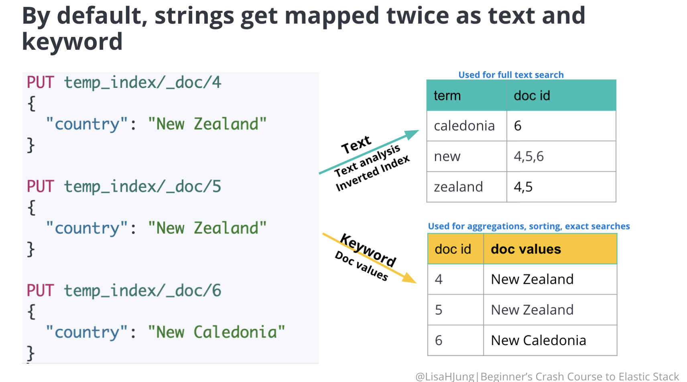

# Beginner's Crash Course to Elastic Stack
* The course repo: [Beginner's Crash Course to Elastic Stack Series](https://github.com/LisaHJung/Beginners-Crash-Course-to-Elastic-Stack-Series-Table-of-Contents)
* The YouTube playlist: [Beginner's Crash Course to Elastic Stack](https://www.youtube.com/playlist?list=PL_mJOmq4zsHZYAyK606y7wjQtC0aoE6Es)
## 1. Intro to Elasticsearch and Kibana
### 1.1. Theory
* **Kibana:** Provide some kind of a GUI to analyze & visualize things.
* **Nodes:** In a cluster, there could be one or more nodes with unique IDs and names. Each node stores data in JSON format with unique IDs.
    * [From a question] Nodes use cache to find data faster on OS.
* **Index:** Documents could be grouped into an index like "product index" and "customer index" like databases.
* **Shards:** Parts of the data stored in each nodes. For example, "product index" could be divided into 3 shards in 3 different nodes in 1 cluster with each containing 200k documents (600k in total).
    * Sharding boosts performance: I can search through 600k documents in 1 shard in a nodes to retrieve some information and it could take 10 seconds. If we divide the index into 10 shards, we can do the searching in parallel (i.e. simultaneously in each shard which has 60k docs) and retrieve the information in 1 second.
    * Replica Shards: Primary shards are denoted as P0, P1... in the video. Replicas are R0, R1 etc. They are the backups of the primary shards. If one shard dies, replica one quickly replaces it in no time. Also, it speeds up the query searching as well like mentioned.
* Command syntax: `GET _API/parameter`
* **RDBMS vs. Elasticsearch:** Actually, elasticsearch is not a database. It just stores documents to be searched and performed analytics. It is schema-free and designed for full-text searches. You can fine-tune the relevance of your search result when it comes to precision, ranking and recall.
### 1.2. Practice: Performing CRUD operations
```js
GET _cluster/health
GET _nodes/stats

// creates an index
PUT favorite_candy

// indexes a document
POST favorite_candy/_doc
{
"first_name": "Mert",
"candy": "Sour Skittles"
}

// this assigns a random ID
POST favorite_candy/_doc
{
"first_name": "Mert",
"candy": "Sour Skittles"
}

// this assigns a random ID
POST favorite_candy/_doc  
{
"first_name": "Mert",
"candy": "Sour Skittles"
}

// this assigns our desired ID, which is 1
POST favorite_candy/_doc/1
{
"first_name": "Mert",
"candy": "Sour Skittles"
}

// overwrites Mert's doc
PUT favorite_candy/_doc/1
{
"first_name": "Betül"
}

// so we use '_create' endpoint to prevent overwriting
PUT favorite_candy/_create/1
{
"first_name": "Mert",
"candy": "Sour Skittles"  // throws error since we already have the doc with ID of 1
}

// read the doc
GET favorite_candy/_doc/1

// updates the document
POST favorite_candy/_update/1
{
"doc": {
    "candy": "M&M's",
    "last_name": "Gül"
}
}

// delete a document
DELETE favorite_candy/_doc/MkOTNYwBI2hu9uu_O0Ez

# THIS WAS THE DEFAULT QUERY when I installed elasticsearch.
// Click the Variables button, above, to create your own variables.
GET ${exampleVariable1} // _search
{
    "query": {
        "${exampleVariable2}": {} // match_all
    }
}
```
## 2. Relevance of a Search
### 2.1. Theory
* Documents with similar traits are grouped into an index.
* Precision & recall don't determine which of the returned documents are more relevant compared to each other. This is determined by ***ranking***.
* **Hit**: A search result presented to user.
* There are multiple factors to compute a document's ranking score. We will use these 2 for now:
    * **Term Frequency (TF):** Calculates the number of query terms mentioned in the document. Let the query be "how to form good habits". It calculates the frequency of each word (i.e. "how", "to", "form", "good", "habits") in the documents. For example, if "habits" is mentioned 4 times in a doc while others have 3, 2 or 1 time, TF of the best ranked hit/doc will be $TF=4.$ Of course it has a slightly different normalized equation of this metric and the score is not 4 blatantly.
    * **Inverse Document Frequency (IDF):** It diminishes the weight of terms that occur very frequently in the document set and increases the weight of terms that occur rarely.
* In other words,

    $TF(word)=\frac{\text{Total number of words in the document}}
    {\text{Number of times the word appears in a document}}$
    
    $IDF(word)=log_e(\frac{\text{Total number of documents}}{\text{Number of documents with the word in it}})$

    $TF\text{-}IDF(word)=TF(word)×IDF(word)$
### 2.2. Practice: Search for information
* By the way, we can delete an index we uploaded just by typing `DELETE news_headlines`.
* Result of `GET news_headlines/_search`:
    ```js
    ...
    },
    "hits": {
        "total": {
        "value": 10000,
        "relation": "gte"
        },
    ...
    ```
    * First 10k results are retrieved. The `relation` field tells you this:
        * `gte`: Equal or greater than 10k.
        * `eq`: Equal to that number.
* Result of
    ```js
    // get the total number of hits
    GET news_headlines/_search
    {
        "track_total_hits": true
    }
    ```
    is this:
    ```js
    ...
    },
      "hits": {
        "total": {
            "value": 209527,
            "relation": "eq"
        },
    ...
    ```
* There are two ways to retrieve data in elasticsearch: Aggregations and Queries.
    * ***Queries*** tell elasticsearch to retrieve results that match the criteria.
        ```js
        // syntax
        GET enter_name_of_the_index_here/_search
        {
            "query": {
                "Specify the type of query here": {
                    "Enter name of the field here": {
                        "gte": "Enter lowest value of the range here",
                        "lte": "Enter highest value of the range here"
                    }
                }
            }
        }

        // query data for certain time period
        GET news_headlines/_search
        {
            "query": {
                "range": {
                    "date": {
                        "gte": "2015-06-20",
                        "lte": "2015-09-22"
                        }
                }
            }
        }
        ```
    * ***Aggregations*** summarizes the data as metrics, statistics, and other analytics. So, we don't get the documents themselves here.
        ```js
        // syntax
        GET enter_name_of_the_index_here/_search
        {
            "aggs": {
                "name your aggregation here": {
                    "specify aggregation type here": {
                            "field": "name the field you want to aggregate here",
                            "size": state how many buckets you want returned here
                        }
                    }
                }
        }

        // query data for certain time period
        GET news_headlines/_search
        {
            "aggs": {
                "by_category": {
                    "terms": {
                        "field": "category",
                        "size": 100
                    }
                }
            }
        }
        ```
* A combination of query and aggregation request: Search for the most significant term in a category
    ```js
    GET enter_name_of_the_index_here/_search
    {
        "query": {
            "match": {
               "Enter the name of the field": "Enter the value you are looking for"
            }
        },
        "aggregations": {
            "Name your aggregation here": {
                "significant_text": {
                    "field": "Enter the name of the field you are searching for"
                }
            }
        }
    }
    ```
* **Precision and Recall:** By default, the `match` query uses `OR` logic. In the query below, there are a few articles slightly irrelevant to `"Khloe Kardashian Kendall Jenner"` because a few hits mention the wrong Kardashian. `OR` logic results in higher number of hits, thereby ***increasing recall***. However, the hits are loosely related to the query and ***lowering precision*** as a result.
    * Syntax:
        ```js
        GET enter_name_of_index_here/_search
        {
            "query": {
                "match": {
                    "Specify the field you want to search": {
                        "query": "Enter search terms"
                    }
                }
            }
        }
        ```

    * Example:
        ```js
        GET news_headlines/_search
        {
            "query": {
                "match": {
                    "headline": {
                        "query": "Khloe Kardashian Kendall Jenner"
                    }
                }
            }
        }
        ```
* We can specify the `operator` type to `AND` but we get too few results this time. Even though we increase the precision, we get lower recall. To fine-tune the precision/recall ratio, we can use `minimum_should_match` field to restrict the minimum # of search terms to match. Setting it to 3 for example gives better result since at least 3 words (could be 4 as well) from the query should match in the `headline`s.
* Entire code:
    ```js
    GET news_headlines/_search

    // get the total number of hits
    GET news_headlines/_search
    {
        "track_total_hits": true
    }

    // query data for certain time period
    GET news_headlines/_search
    {
        "query": {
            "range": {
                "date": {
                    "gte": "2015-06-20",
                    "lte": "2015-09-22"
                }
            }
        }
    }

    // aggregations by category
    GET news_headlines/_search
    {
        "aggs": {
            "by_category": {
                "terms": {
                    "field": "category",
                    "size": 100
                }
            }
        }
    }

    // query + aggregations
    GET news_headlines/_search
    {
        "query": {
            "match": {
                "category": "ENTERTAINMENT"
            }
        },
        "aggregations": {
            "popular_words_in_entertainment": {
                "significant_text": {
                    "field": "headline"
                }
            }
        }
    }

    // query certain words (default operator: OR logic)
    GET news_headlines/_search
    {
        "query": {
            "match": {
                "headline": {
                    "query": "Khloe Kardashian Kendall Jenner"
                }
            }
        }
    } // fetches 955 results. too large!

    // query certain words (operator: AND logic)
    GET news_headlines/_search
    {
        "query": {
            "match": {
                "headline": {
                    "query": "Khloe Kardashian Kendall Jenner",
                    "operator": "and" // i want all 4 words
                }
            }
        }
    } // fetches only 1 result. too strict!

    // query certain words (specify # of search terms to match)
    GET news_headlines/_search
    {
        "query": {
            "match": {
                "headline": {
                    "query": "Khloe Kardashian Kendall Jenner",
                    "minimum_should_match": 3 // at least 3 search terms
                }
            }
        }
    } // fetches 6 hits.
    ```
## 3. Full-Text & Combined Queries
### 3.1. Theory
* Since `match` query doesn't care about word order, in a lyric search, let's say, the results could be completely irrelevant. Thus, `match_phrase` is more successful retrieving more relevant and exact queries. Since it is looking for exact queries, recall is a bit lower I guess.
* When the `match_phrase` parameter is used, all hits must meet the following criteria:
    * the search terms "Shape", "of", and "you" must appear in the field headline,
    * the terms must appear in that order,
    * the terms must appear next to each other.
* Cool Observation: When I tried the same query (the song _"Shape of You"_) with `match` with `AND` operator instad `match_phrase`, I got 5 hits instead of 3 because the other 2 headlines contained stuff like `Shape of your body...`. So, it seems that `match_phrase` is indeed better at phrases.
* When designing a `query`, you don't always know the context of a user's search. When a user searches for "Michelle Obama", the user could be searching for statements written by Michelle Obama or articles written about her. To accommodate these contexts, we can write a `multi_match query`, which searches for terms in multiple fields. The `multi_match query` runs a `match query` on multiple fields and calculates a score for each field. Then, it assigns the highest score among the fields to the document. This score will determine the ranking of the document within the search results.
    * Elasticsearch will search for results with "Michelle" `OR` "Obama" among the specified fields. So, ***expect high recall!***
    * Thus, to match phrases like in `match_phrase`, we need to specify that the `type` of the `multi_match` we are querying is `phrase`. How? See the practice codes.
* **Per-field Boosting:** We can boost a field we wanna put more emphasis on. With just a carat `^` symbol, we can boost a field.
* **Combined Queries:** If we want "Michelle Obama" in headlines, and the article is about "POLITICS", and they are from 2016, what do we do? We use `bool query`. Syntax:
    ```js
    GET name_of_index/_search
    {
        "query": {
            "bool": {
                "must": [
                    {One or more queries can be specified here. A document MUST match all of these queries to be considered as a hit.}
                ],
                "must_not": [
                    {A document must NOT match any of the queries specified here. If it does, it is excluded from the search results.}
                ],
                "should": [
                    {A document does not have to match any queries specified here. However, if it does match, this document is given a higher score.}
                ],
                "filter": [
                    {These filters(queries) place documents in either yes or no category. Ones that fall into the yes category are included in the hits.}
                ]
            }
        }
    }
    ```
### 3.2. Practice: Some More Advanced Stuff
```js
// searching for a phrase, not search terms with "match_phrase"
GET news_headlines/_search
{
  "query": {
    "match_phrase": {
      "headline": {
        "query": "Shape of you"
      }
    }
  }
}

// multiple match with equal weights on the fields with "multi_match"
GET news_headlines/_search
{
  "query": {
    "multi_match": {
      "query": "Michelle Obama",
      "fields": [
        "headline",
        "short_description",
        "authors"
      ]
    }
  }
}

// multiple match with "headline" field boosted #1
GET news_headlines/_search
{
  "query": {
    "multi_match": {
      "query": "Michelle Obama", // query logic: OR
      "fields": [
        "headline^2",
        "short_description",
        "authors"
      ]
    }
  }
}  // gives 5k hits.

// multi_match with "headline" field boosted #2
GET news_headlines/_search
{
  "query": {
    "multi_match": {
      "query": "party planning", // query logic: OR
      "fields": [
        "headline^2",
        "short_description"
      ]
    }
  }
}  // gives 2951 hits.

// multi_match search for a phrase this time (still boosted)
GET news_headlines/_search
{
  "query": {
    "multi_match": {
      "query": "party planning",
      "fields": [
        "headline^2",
        "short_description"
      ],
      "type": "phrase"
    }
  }
}  // gives 6 hits. much lower recall but good precision.

// we'll list the headlines mention "Michelle Obama" as a phrase and aggregate them by category
GET  news_headlines/_search
{
  "query": {
    "match_phrase": {
      "headline": "Michelle Obama"
    }
  },
  "aggregations": {
    "category_mentions": {
      "terms": {
        "field": "category",
        "size": 100
      }
    }
  }
}

// combined query: headline + category (must)
GET news_headlines/_search
{
  "query": {
    "bool": {
      "must": [
        {
          "match_phrase": {
            "headline": "Michelle Obama"
          }
        },
        {
          "match": {
            "category": "POLITICS"
          }
        }
      ]
    }
  }
}

// combined query: exclude one of the categories (must_not)
GET news_headlines/_search
{
  "query": {
    "bool": {
      "must": [
        {
          "match_phrase": {
            "headline": "Michelle Obama"
          }
        }
      ],
      "must_not": [
        {
          "match": {
            "category": "WEDDNGS"
          }
        }
      ]
    }
  }
}

// combined query: nice to have if an article's category is a certain value (should; gives higher score to it)
GET news_headlines/_search
{
  "query": {
    "bool": {
      "must": [
        {
          "match_phrase": {
            "headline": "Michelle Obama"
          }
        }
      ],
      "should": [
        {
          "match": {
            "category": "BLACK VOICES"
          }
        }
      ]
    }
  }
} // # of hits doesn't change but ordering does!

// combined query: articles between a specific date (filter)
GET news_headlines/_search
{
  "query": {
    "bool": {
      "must": [
        {
          "match_phrase": {
            "headline": "Michelle Obama"
          }
        }
      ],
      "should": [
        {
          "match": {
            "category": "BLACK VOICES"
          }
        }
      ],
      "filter": [
        {
          "range": {
            "date": {
              "gte": "2014-03-25",
              "lte": "2016-03-25"
            }
          }
        }
      ]
    }
  }
} // hits drop to 33 since filtered.
```
## 4. Aggregations
### 4.1. Theory
* There are 4 ***bucket aggregations***:
    1. Date Histogram Agregation
        * Fixed_interval
        * Calendar_interval
    2. Histogram Aggregation
    3. Range Aggregation
    4. Terms Aggregation
* **Combined Aggregations**: So far, we have ran ***metric aggregations*** or ***bucket aggregations*** to answer simple questions. There will be times when we will ask more complex questions that require running combinations of these aggregations.
* `[not completed]` Study: [How to write scripts](https://www.elastic.co/guide/en/elasticsearch/reference/current/modules-scripting-using.html)
* _**Q:** Aggregated result is based on shard level correct?_
* _**A:** Yes! Aggregation is performed on every shard and the results from every shard are sent to the coordinator node. The coordinator node merges the shard results together into one final response which is sent to the user._
### 4.2. Practice
```js
GET ecommerce_data/_search
{
  "track_total_hits": true,
  "size": 3, 
  "query": {
    "match_all": {}
  }
}

// adjust bad debt records
POST ecommerce_data/_delete_by_query
{
  "query": {
    "range": {
      "UnitPrice": {
        "lte": 0
      }
    }
  }
}

// remove extreme values: almost all the UnitPrice values are below 500.
POST ecommerce_data/_delete_by_query
{
  "query": {
    "range": {
      "UnitPrice": {
        "gte": 500
      }
    }
  }
}

// sum
GET ecommerce_data/_search
{
  "size": 0,
  "aggs": {
    "sum_unit_price": {
      "sum": {
        "field": "UnitPrice"
      }
    }
  }
}

// min
GET ecommerce_data/_search
{
  "size": 0,
  "aggregations": {
    "min_unit_price" : {
      "min": {
        "field": "UnitPrice"
      }
    }
  }
}

// max
GET ecommerce_data/_search
{
  "size": 0,
  "aggs": {
    "max_unit_price": {
      "max": {
        "field": "UnitPrice"
      }
    }
  }
}

// average
GET ecommerce_data/_search
{
  "size": 0,
  "aggs": {
    "max_unit_price": {
      "avg": {
        "field": "UnitPrice"
      }
    }
  }
}

// statistics
GET ecommerce_data/_search
{
  "size": 0,
  "aggs": {
    "stats_of_unit_price": {
      "stats": {
        "field": "UnitPrice"
      }
    }
  }
}

// cardinality/unique values
GET ecommerce_data/_search
{
  "size": 0,
  "aggs": {
    "unique_customer_count": {
      "cardinality": {
        "field": "Country"
      }
    }
  }
}

// Mert: list unique countries
GET ecommerce_data/_search
{
  "size": 0,
  "aggs": {
    "unique_countries": {
      "terms": {
        "field": "Country",
        "size": 100
      }
    }
  }
}

// average at a specific country
GET ecommerce_data/_search
{
  "size": 0,
  "query": {
    "match": {
      "Country": "Finland"
    }
  },
  "aggs": {
    "average_of_country": {
      "avg": {
        "field": "UnitPrice"
      }
    }
  }
}

// 1. date histogram aggregation: fixed_interval
GET ecommerce_data/_search
{
  "size": 0, 
  "aggs": {
    "transactions_by_8hrs": {
      "date_histogram": {
        "field": "InvoiceDate",
        "fixed_interval": "8h"
      }
    }
  }
}

// 1. date histogram aggregation: calendar_interval
GET ecommerce_data/_search
{
  "size": 0, 
  "aggs": {
    "transactions_by_8hrs": {
      "date_histogram": {
        "field": "InvoiceDate",
        "calendar_interval": "1M",
        "order": {
          "_key": "desc"
        }
      }
    }
  }
}

// 2. histogram aggregation
GET ecommerce_data/_search
{
  "size": 1,
  "aggs": {
    "transaction_per_price_interval": {
      "histogram": {
        "field": "UnitPrice",
        "interval": 50,
        "order": {
          "_key": "asc"
        }
      }
    }
  }
}

// 3. range aggregation
GET ecommerce_data/_search
{
  "size": 0,
  "aggs": {
    "transactions_per_date_ranges": {
      "range": {
        "field": "InvoiceDate",
        "ranges": [
          {
            "from": "1/1/2011 00:00",
            "to": "2/1/2011 00:00"
          },
          {
            "from": "06/1/2011 00:07",
            "to": "06/1/2011 12:45"
          },
          {
            "from": "12/1/2011 00:00"
          }
        ]  // cannot sort these
      }
    }
  }
}

// 4. terms aggregation: top 5
GET ecommerce_data/_search
{
  "size": 0,
  "aggregations": {
    "top_5_customers": {
      "terms": {
        "field": "CustomerID",
        "size": 5,
        "order": {
          "_count": "desc"  // not _key, but _count !!!
        }
      }
    }
  }
}

// 4. terms aggregation: worst 5
GET ecommerce_data/_search
{
  "size": 0,
  "aggregations": {
    "top_5_customers": {
      "terms": {
        "field": "CustomerID",
        "size": 5,
        "order": {
          "_count": "asc"  // not _key, but _count !!!
        }
      }
    }
  }
}

# Combined Aggregations
// sum of revenue per month
GET ecommerce_data/_search
{
  "size": 0,
  "aggs": {
    "transaction_per_month": {
      "date_histogram": {
        "field": "InvoiceDate",
        "calendar_interval": "month",
        "order": {
          "monthly_revenue": "desc"
        }
      },
      "aggs": {
        "monthly_revenue": {
          "sum": {
            "script": {
              "source": "doc['UnitPrice'].value * doc['Quantity'].value"
            }
          }
        }
      }
    }
  }
}

// multiple metrics per bucket: monthly revenue and the number of unique customers per month
GET ecommerce_data/_search
{
  "size": 0,
  "aggs": {
    "transaction_per_month": {
      "date_histogram": {
        "field": "InvoiceDate",
        "calendar_interval": "month",
        "order": {
          "unique_customers_per_month": "desc"
        }
      },
      "aggs": {
        "monthly_revenue": {
          "sum": {
            "script": {
              "source": "doc['UnitPrice'].value * doc['Quantity'].value"
            }
          }
        },
        "unique_customers_per_month": {
          "cardinality": {
            "field": "CustomerID"
          }
        }
      }
    }
  }
}
```
## 5. Mappings
### 5.1. Theory
* **Dynamic Mapping:** When we index a document in elastic without providing any mapping, elasticsearch automatically infers the data types from the field contents. So it creates or updates the mapping by default. This is called ***dynamic mapping***.
* For the list of all field types, click [here](https://www.elastic.co/guide/en/elasticsearch/reference/current/mapping-types.html)!
* By default, every string gets mapped twice as a text field and as a keyword multi-field. Each field type is primed for different types of requests.
    * ***Text*** field type is designed for full-text searches.
    * ***Keyword*** field type is designed for exact searches, aggregations, and sorting.
* In ***text field type***, text analysis is performed and every token is assigned an inverse index ID. The same process occurs every time you index a new document.

* Double indexing of strings is a bit wasteful. So it's better to plan the use cases of the fields and assign a type accordingly. Example:
    |String Fields|Desired Field Type|
    |:------------|:----------------:|
    |country_of_origin|text & keyword|
    |description, name|text only|
    |produce_type|keyword|
* Rules of Defining your own mapping:
    1. If you do not define a mapping ahead of time, Elasticsearch dynamically creates the mapping for you.
    2. If you do decide to define your own mapping, you can do so at index creation.
    3. ONE mapping is defined per index. Once the index has been created, we can only add new fields to a mapping. We CANNOT change the mapping of an existing field.
    4. If you must change the type of an existing field, you must create a new index with the desired mapping, then reindex all documents into the new index.
* Since we can't change the mapping of a field (e.g. a disabled field needs to be enabled again), we have to create a new index and reindex the old one onto it.
* ***Runtime*** **Field**: Creating a temporary field to use. It is created only when a user runs a request against the runtime field (see the field below: `Name-your-runtime-field-here`).
    ```js
    PUT Enter-name-of-index/_mapping
    {
        "runtime": {
            "Name-your-runtime-field-here": {
                "type": "Specify-field-type-here",
                "script": {
                    "source": "Specify the formula you want executed"
                }
            }
        }
    }
    ```
* `GET newest_temp_index/_mapping` ---> Note that the runtime field is not listed under `properties` object which includes the fields in the documents. This is because the runtime field `total` is not indexed!
* **Q:** If possible please explain the `_meta` in mapping which was part of previous video?
    * **A:** So the `_meta` field was automatically created by the ml file data visualizer. This is a field where you can store any information regarding the index or the app for developers who are managing it. Think of this field as a place where you can include information regarding the app so developers have info necessary to debug.
    ```js
    {
        "mappings": {
            "_meta": {
               "created_by": "Mert"
            },
            "properties": {
                "botanical_name": {
    ...
    ```
### 5.2. Practice
```js
// index a sample document
POST temp_index/_doc
{
    "name": "Pineapple",
    "botanical_name": "Ananas comosus",
    "produce_type": "Fruit",
    "country_of_origin": "New Zealand",
    "date_purchased": "2020-06-02T12:15:35",
    "quantity": 200,
    "unit_price": 3.11,
    "description": "a large juicy tropical fruit consisting of aromatic edible yellow flesh surrounded by a tough segmented skin and topped with a tuft of stiff leaves.These pineapples are sourced from New Zealand.",
    "vendor_details": {
        "vendor": "Tropical Fruit Growers of New Zealand",
        "main_contact": "Hugh Rose",
        "vendor_location": "Whangarei, New Zealand",
        "preferred_vendor": true
    }
}

// view the mappings
GET temp_index/_mapping

// edit the mappings
// Alternative 1: You can copy/paste the output of GET temp_index/_mapping command, delete the 2nd line which contains "temp_index": {..., and modify the mappings.
// Alternative 2: Write everything one by one.
PUT new_temp_index
{
  "mappings": {
    "properties": {
      "botanical_name": {
        "enabled": false
      },
      "country_of_origin": {
        "type": "text",
        "fields": {
          "keyword": {
            "type": "keyword"
          }
        }
      },
      "date_purchased": {
        "type": "date"
      },
      "description": {
        "type": "text"
      },
      "name": {
        "type": "text"
      },
      "produce_type": {
        "type": "keyword"
      },
      "quantity": {
        "type": "long"
      },
      "unit_price": {
        "type": "float"
      },
      "vendor_details": {
        "enabled": false
      }
    }
  }
}

// view the new mappings of the new index
GET new_temp_index/_mapping

// index a document into it
POST new_temp_index/_doc
{
    "name": "Pineapple",
    "botanical_name": "Ananas comosus",
    "produce_type": "Fruit",
    "country_of_origin": "New Zealand",
    "date_purchased": "2020-06-02T12:15:35",
    "quantity": 200,
    "unit_price": 3.11,
    "description": "a large juicy tropical fruit consisting of aromatic edible yellow flesh surrounded by a tough segmented skin and topped with a tuft of stiff leaves.These pineapples are sourced from New Zealand.",
    "vendor_details": {
        "vendor": "Tropical Fruit Growers of New Zealand",
        "main_contact": "Hugh Rose",
        "vendor_location": "Whangarei, New Zealand",
        "preferred_vendor": true
    }
}

// add another with a new field "organic"
POST new_temp_index/_doc
{
  "name": "Mango",
  "botanical_name": "Harum Manis",
  "produce_type": "Fruit",
  "country_of_origin": "Indonesia",
  "organic": true,
  "date_purchased": "2020-05-02T07:15:35",
  "quantity": 500,
  "unit_price": 1.5,
  "description": "Mango Arumanis or Harum Manis is originated from East Java. Arumanis means harum dan manis or fragrant and sweet just like its taste. The ripe Mango Arumanis has dark green skin coated with thin grayish natural wax. The flesh is deep yellow, thick, and soft with little to no fiber. Mango Arumanis is best eaten when ripe.",
  "vendor_details": {
    "vendor": "Ayra Shezan Trading",
    "main_contact": "Suharto",
    "vendor_location": "Binjai, Indonesia",
    "preferred_vendor": true
  }
}

// view the mappings again. see the new field
GET new_temp_index/_mapping

// enable "botanical_name" again with a new index
PUT newest_temp_index
{
  "mappings": {
    "_meta": {
      "created_by": "Mert"
    },
    "properties": {
      "botanical_name": {
        "type": "text"
      },
      "country_of_origin": {
        "type": "text",
        "fields": {
          "keyword": {
            "type": "keyword"
          }
        }
      },
      "date_purchased": {
        "type": "date"
      },
      "description": {
        "type": "text"
      },
      "name": {
        "type": "text"
      },
      "organic": {
        "type": "boolean"
      },
      "produce_type": {
        "type": "keyword"
      },
      "quantity": {
        "type": "long"
      },
      "unit_price": {
        "type": "float"
      },
      "vendor_details": {
        "type": "object",
        "enabled": false
      }
    }
  }
}

// view the mappings again. see the enabled field
GET newest_temp_index/_mapping

// reindex the data from original index
POST _reindex
{
  "source": {
    "index": "new_temp_index"
  },
  "dest": {
    "index": "newest_temp_index"
  }
}

// Optional: You can delete old index, create a new mapping with the same name, reindex it and deleted the previous one.

// runtime field: Like a function. Only runs when that field name is requested. Not stored.
PUT newest_temp_index/_mapping
{
  "runtime": {
    "total": {
      "type": "double",
      "script": {
        "source": "emit(doc['unit_price'].value* doc['quantity'].value)"
      }  // To calculate total expense. btw, emit is required. it's probably similar to eval() in Python.
    }
  }
}

// view the mappings to see the "runtime" field. Note that the runtime field is not listed under properties object which includes the fields in the documents.
GET newest_temp_index/_mapping

// send an aggregation request to calculate "total expense"
GET newest_temp_index/_search
{
  "size": 0,
  "aggs": {
    "total_expense": {
      "sum": {
        "field": "total"
      }
    }
  }
}
```